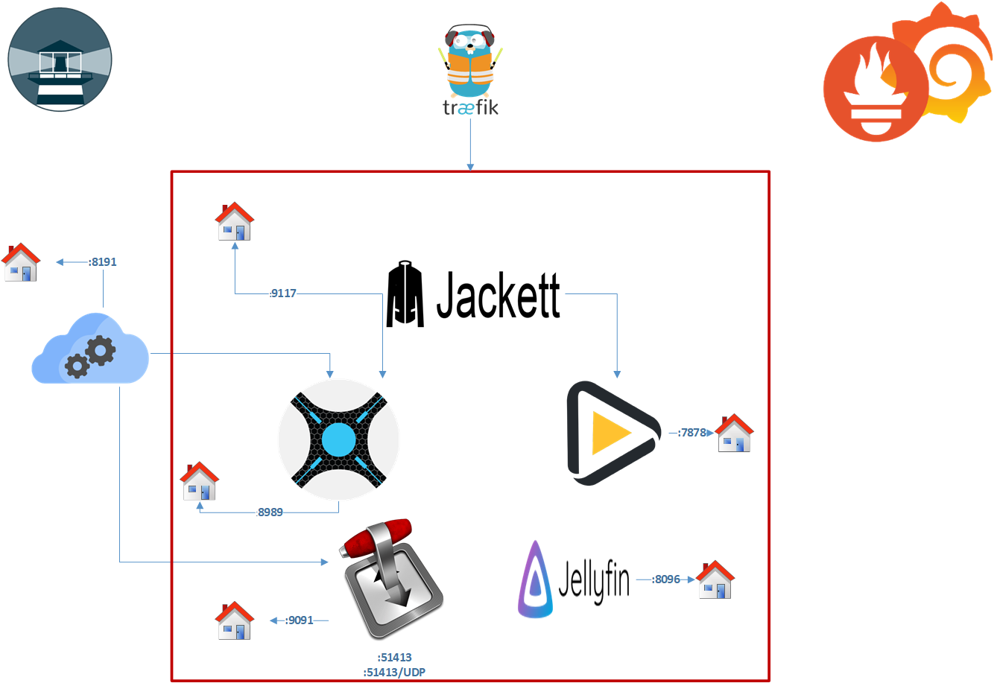

# TP Contenerisation & Orchestration

## Schéma d'architecture


L'architecture est déployée sur Docker et comprend une chaine complète pour le téléchargement et le management de films et séries téléchargés. Sonarr et Radarr sont chargés de rechercher des séries ou des films que l'on requête. Ils envoient ainsi cette requête vers Jackett, qui s'occupe de faire les recherches, et les renvoie vers Sonarr et Radarr. Si un résultat correspond aux attentes, alors le torrent est récupéré, puis renommé et placé dans un dossier /Downloads. Bazarr cherche et télécharge les sous-titres associés au torrent récupéré par Sonarr et Radarr. 
Transmission, ensuite, s'occupe de récupérer le fichier torrent dans /Downloads et de le télécharger. 
Enfin, Jellyfin permet d'avoir une bibliothèque des films et séries que l'on possède. Une fois intégré à la bibliothèque Jellyfin, les films, les séries et la musique présents sur l'application sont disponibles à n'importe quelle adresse avec un client Jellyfin (disponible sur Android, navigateurs Web etc.).



Autour de cette architecture, nous retrouvons Traefik, qui sert ici de reverse-proxy. Il permet d'accéder aux interfaces Web de chaque service. Portainer, non présent sur le schéma car ne faisant pas réellement parti de l'infrastructure, est un service permettant de gérer plus facilement les containers Docker. Watchtower permet l'automatisation des mises à jour des images. Enfin, une partie monitoring, composée de Prometheus et de Grafana.

## Déploiement

Pour déployer le projet, il suffit de le cloner, de se rendre dans le dossier torrent_tp puis de lancer la commande suivante :

```
docker-compose up -d
```

## Focus sur les différents containers

### Jackett

Jackett est un service qui agit en tant que proxy. Il reçoit les requêtes venant de Sonarr et Radarr, requêtes contenant un nom de film ou de série, et effectue les recherches concernant cette requête. Ses résultats sont ensuite envoyés vers Sonarr et Radarr. 

### Transmission

Transmission est un client BitTorrent open-source. Transmission télécharge un torrent, puis le dépose dans un dossier /Downloads. Il fonctionne avec Sonarr, de qui il reçoit les torrents à télécharger. 

### Sonarr

Sonarr permet de monitorer des flux RSS pour trouver de nouveaux épisodes d'une série donnée, pour ensuite les envoyer vers Transmission pour les télécharger. Il est également capable de chercher des épisodes/films déjà téléchargés en meilleur qualité. 

### Radarr

Radarr a un rôle similaire à Sonarr. De la même manière, Radarr monitore les flux RSS pour chercher les films et séries à télécharger. Il intéragit également avec Transmission, à qui il envoie les torrents.

### Bazarr

Bazarr fonctionne avec Sonarr et Radarr. Il regarde les fichiers présents dans /Downloads et cherche les sous-titres associés aux torrents présents. 

### Jellyfin

Jellyfin permet la création d'une bibliothèque de fichiers (films, séries, musique). Cette bibliothèque est ensuite accessible sur d'autres plateformes à travers des clients, tels que l'application Android Jellyfin, sur télévision, ou d'autres ordinateurs. 

### Traefik

```yaml
  traefik:
    image: traefik:v2.0
    restart: always
    container_name: traefik
    ports:
      - "80:80" # <== http
      - "8080:8080" # <== :8080 is where the dashboard runs on
      - "443:443" # <== https
    command:
    #### These are the CLI commands that will configure Traefik and tell it how to work! ####
      ## API Settings - https://docs.traefik.io/operations/api/, endpoints - https://docs.traefik.io/operations/api/#endpoints ##
      - --api.insecure=true # <== Enabling insecure api, NOT RECOMMENDED FOR PRODUCTION
      - --api.dashboard=true # <== Enabling the dashboard to view services, middlewares, routers, etc...
      - --api.debug=true # <== Enabling additional endpoints for debugging and profiling
      ## Log Settings (options: ERROR, DEBUG, PANIC, FATAL, WARN, INFO) - https://docs.traefik.io/observability/logs/ ##
      - --log.level=DEBUG # <== Setting the level of the logs from traefik
      ## Provider Settings - https://docs.traefik.io/providers/docker/#provider-configuration ##
      - --providers.docker=true # <== Enabling docker as the provider for traefik
      - --providers.docker.exposedbydefault=false # <== Don't expose every container to traefik, only expose enabled ones
      #- --providers.file.filename=/dynamic.yaml # <== Referring to a dynamic configuration file
      - --providers.docker.network=mynet # <== Operate on the docker network named web
      ## Entrypoints Settings - https://docs.traefik.io/routing/entrypoints/#configuration ##
      #- --entrypoints.web.address=:80 # <== Defining an entrypoint for port :80 named web
      - --entrypoints.web-secured.address=:443 # <== Defining an entrypoint for https on port :443 named web-secured
      ## Certificate Settings (Let's Encrypt) -  https://docs.traefik.io/https/acme/#configuration-examples ##
      - --certificatesresolvers.mytlschallenge.acme.tlschallenge=true # <== Enable TLS-ALPN-01 to generate and renew ACME certs
      - --certificatesresolvers.mytlschallenge.acme.email=theafkdeveloper@gmail.com # <== Setting email for certs
      - --certificatesresolvers.mytlschallenge.acme.storage=/letsencrypt/acme.json # <== Defining acme file to store cert information
      - --certificatesresolvers.mytlschallenge.acme.caserver=https://acme-v02.api.letsencrypt.org/directory   
      #- --certificatesresolvers.myresolver.acme.dnschallenge.provider=noip
    volumes:
      - ./letsencrypt:/letsencrypt # <== Volume for certs (TLS)
      - /var/run/docker.sock:/var/run/docker.sock # <== Volume for docker admin
      #- ./dynamic.yaml:/dynamic.yaml # <== Volume for dynamic conf file, **ref: line 27
    networks:
      - mynet # <== Placing traefik on the network named web, to access containers on this network
    labels:
    #### Labels define the behavior and rules of the traefik proxy for this container ####
      - "traefik.enable=true" # <== Enable traefik on itself to view dashboard and assign subdomain to view it
      - "traefik.http.routers.api.rule=Host(`dockermodule.ddns.net`)" # <== Setting the domain for the dashboard
      - "traefik.http.routers.api.service=api@internal" # <== Enabling the api to be a service to access
      - "traefik.http.routers.api.entrypoints=web-secured"
      - "traefik.http.routers.api.tls=true"
      - "traefik.http.routers.api.tls.certresolver=mytlschallenge"
```

Traefik est un reverse-proxy. Il permet d'accéder aux interfaces Web des services de l'architecture. Pour ajouter un service à Traefik, il faudra d'abord spécifier plusieurs labels dans le docker-compose (Exemple présent dans la catégorie suivante, pour Portainer). Traefik ici utilise Letsencrypt pour la sécurisation de la plateforme.

## Portainer

```yaml
  portainer:
    container_name: portainer
    image: portainer/portainer-ce:latest
    restart: unless-stopped
    command: -H unix:///var/run/docker.sock
    #ports:
     # - 9000:9000

    volumes:
      - /var/run/docker.sock:/var/run/docker.sock:ro
      - /etc/localtime:/etc/localtime:ro
      - /etc/timezone:/etc/timezone:ro
      - /home/tp_torrent/torrent_tp/dataportainer:/data
    labels:
    #front
      - "traefik.enable=true"
      - "traefik.http.routers.portainer.entrypoints=web"
      - "traefik.http.routers.portainer.rule=PathPrefix(`/portainer{regex:$$|/.*}`)"
      - "traefik.http.routers.portainer.middlewares=portainer-prefix"
      - "traefik.http.middlewares.portainer-prefix.stripprefix.prefixes=/portainer"
      - "traefik.http.routers.portainer.service=portainer"
      - "traefik.http.services.portainer.loadbalancer.server.port=9000"
      #back
      - "traefik.http.routers.portainer_back.entrypoints=web"
      - "traefik.http.services.portainer_back.loadbalancer.server.port=8000"
      - "traefik.http.routers.portainer_back.service=portainer_back"
    networks:
      - mynet
```

Portainer est un service permettant d'administrer les containers depuis une interface graphique. On peut ainsi avoir une vue d'ensemble des containers déployés, de leur configuration, de leurs volumes ainsi que leur santé (healthy, unhealthy, running, stopped). On peut également voir dans la configuration les labels associés à Traefik, permettant ainsi d'avoir une interface Web pour le service. 

### Watchtower

Watchtower est un service permettant l'automatisation des mises à jour des images. Lorsqu'une nouvelle version est poussée sur le Docker Hub ou sur un autre registe d'images, Watchtower le détecte et télécharge la nouvelle version, éteint le container et le redémarre avec la nouvelle version de l'image. 

### Prometheus & Grafana

Prometheus et Grafana sont deux outils qui fonctionnent ensemble : Prometheus va chercher des métriques sur chaque container et Grafana permet de les afficher sous forme de graphiques. 
